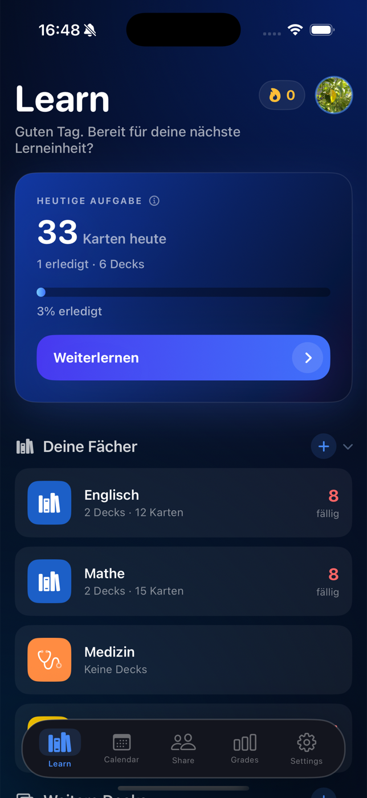
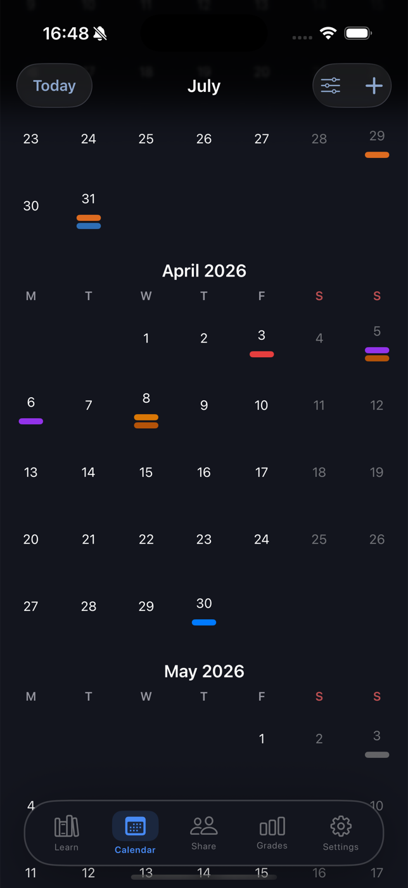
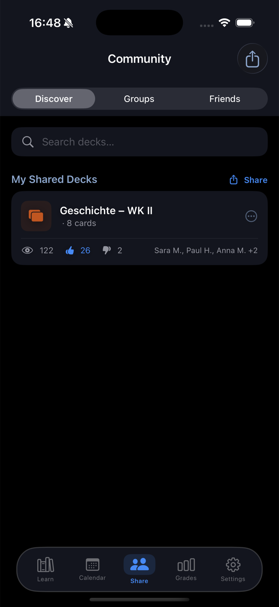
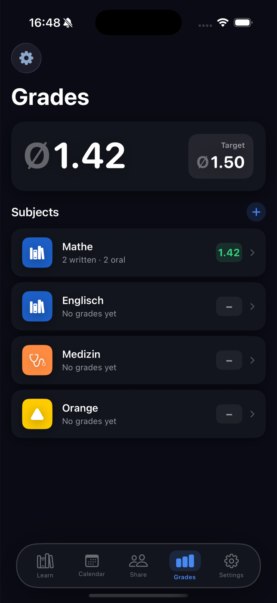
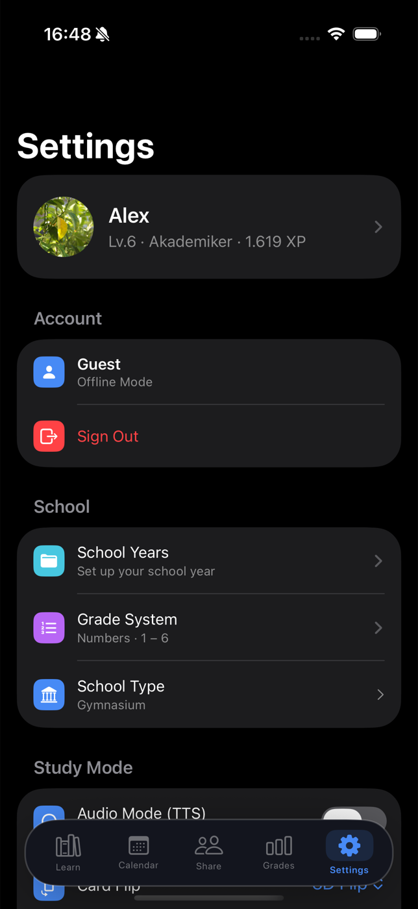

# LearnCenter

**What if your flashcards knew you were about to forget them, and your study plan wrote itself?**

A native iOS app that helps students learn smarter: flashcards, grades, an exam-driven study plan and a calendar in one place.

## The origin of the idea
One day I sat in my room, learning, while the household was waiting: cleaning, tidying up. I like listening to audiobooks, and I wondered: what if I could learn and tidy my room at the same time? That question became LearnCenter, a study app you can use without looking at a screen.

## Things you probably have not seen in a study app
- **Study without looking.** Your cards are read aloud, so you can learn on a walk, on the bus or with your eyes closed.
- **Exam date in, daily plan out.** No planning, no guessing how much to learn today.
- **Cards that adapt to your memory.** Each card comes back at the moment you are about to forget it, not on a fixed schedule.
- **Notes in, cards out.** An AI turns your own notes into flashcards.
- **Answer out loud.** Say your answer instead of typing it.
- **Pensar, a voice AI study partner.** In development.

## Also in the app
Grades with averages and target grades, a calendar with exams and study sessions, community decks, and full offline use as a guest.

## Status
In TestFlight beta. SwiftUI app with a Node.js and PostgreSQL backend for the community features.
